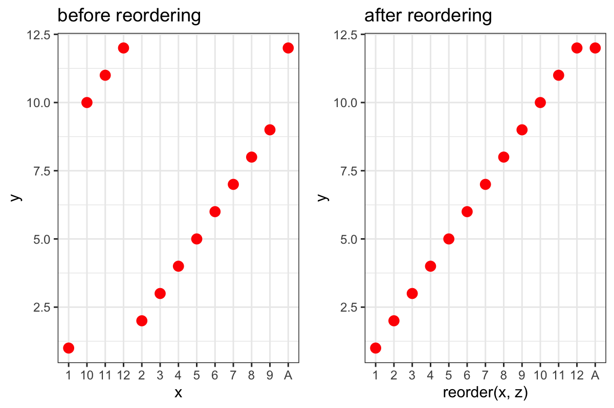

# collection-snippets

Collection of code snippets

# R

## Ordering of Factors

Factors usually order alphabetically, so you may have to order manually. For example, if you would like to order something in ascending order, you could use `reorder`:

```r
ggplot(d1, aes(reorder(x,y),y)) +
  geom_point(size=3, col='red') +
  theme_bw()
```

Here is an example graph:




## Loading Functions


load all functions, except main.R

```r
for(q1 in dir('R', pattern='[^(main)].*\\.R$')) { source(file.path('R',q1)) }
```


# LaTeX

## Using SI units

```latex
\usepackage[output-open-uncertainty = \pm,output-close-uncertainty = ]{siunitx}
\sisetup{detect-weight=true, detect-family=true}
\DeclareSIUnit\mu{m.u.}
```

## Long Subscripts

For long subscripts, use explicit `\mathrm`:

```LaTeX
B_{\mathrm{eff}} = B_0 \left( 1-\sigma \right)
```

