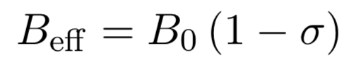

# collection-snippets

Collection of code snippets

## R


load all functions, except main.R

```r
for(q1 in dir('R', pattern='[^(main)].*\\.R$')) { source(file.path('R',q1)) }
```


## LaTeX

Using SI units

```latex
\usepackage[output-open-uncertainty = \pm,output-close-uncertainty = ]{siunitx}
\sisetup{detect-weight=true, detect-family=true}
\DeclareSIUnit\mu{m.u.}
```

For long subscripts, use explicit `\mathrm`:

```LaTeX
B_{\mathrm{eff}} = B_0 \left( 1-\sigma \right)
```

